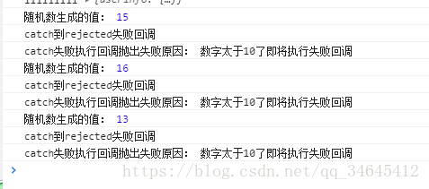
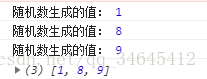
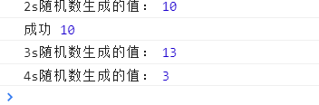
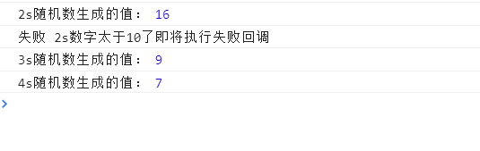

## 1.什么是Promise
Promise 是异步编程的一种解决方案，其实是一个构造函数，自己身上有all、reject、resolve这几个方法，原型上有then、catch等方法。（ps:什么是原型：javascript中的原型与原型链_傻小胖的博客-CSDN博客_javascript原型和原型链）

Promise对象有以下两个特点。


（1）对象的状态不受外界影响。Promise对象代表一个异步操作，有三种状态：pending（进行中）、fulfilled（已成功）和rejected（已失败）。只有异步操作的结果，可以决定当前是哪一种状态，任何其他操作都无法改变这个状态。这也是Promise这个名字的由来，它的英语意思就是“承诺”，表示其他手段无法改变。


（2）一旦状态改变，就不会再变，任何时候都可以得到这个结果。Promise对象的状态改变，只有两种可能：从pending变为fulfilled和从pending变为rejected。只要这两种情况发生，状态就凝固了，不会再变了，会一直保持这个结果，这时就称为 resolved（已定型）。如果改变已经发生了，你再对Promise对象添加回调函数，也会立即得到这个结果。这与事件（Event）完全不同，事件的特点是，如果你错过了它，再去监听，是得不到结果的。


Promise只是能够简化层层回调的写法，而实质上，Promise的精髓是“状态”，用维护状态、传递状态的方式来使得回调函数能够及时调用，它比传递callback函数要简单、灵活的多。所以使用Promise的正确场景是这样的：
```js
promiseClick()
.then(function(data){
    console.log(data);
    return runAsync2();
})
.then(function(data){
    console.log(data);
    return runAsync3();
})
.then(function(data){
    console.log(data);
});
```
这样能够按顺序，每隔两秒输出每个异步回调中的内容，在runAsync2中传给resolve的数据，能在接下来的then方法中拿到。


## 2、resolve和reject的用法

resolve是对promise成功时候的回调，它把promise的状态修改为fullfiled，那么，reject就是失败的时候的回调，他把promise的状态修改为rejected，这样我们在then中就能捕捉到，然后执行“失败”情况的回调。


## 3、catch的用法
与Promise对象方法then方法并行的一个方法就是catch,与try  catch类似，catch就是用来捕获异常的，也就是和then方法中接受的第二参数rejected的回调是一样的，如下：
```js
function promiseClick(){
		let p = new Promise(function(resolve, reject){
			setTimeout(function(){
				var num = Math.ceil(Math.random()*20); //生成1-10的随机数
				console.log('随机数生成的值：',num)
				if(num<=10){
					resolve(num);
				}
				else{
					reject('数字太于10了即将执行失败回调');
				}
			}, 2000);
		   })
		   return p
	   }
 
	promiseClick().then(
		function(data){
			console.log('resolved成功回调');
			console.log('成功回调接受的值：',data);
		}
	)
	.catch(function(reason, data){
		console.log('catch到rejected失败回调');
		console.log('catch失败执行回调抛出失败原因：',reason);
	});	
```

执行结果：  

效果和写在then的第二个参数里面一样。它将大于10的情况下的失败回调的原因输出，但是，它还有另外一个作用：在执行resolve的回调（也就是上面then中的第一个参数）时，如果抛出异常了（代码出错了），那么并不会报错卡死js，而是会进到这个catch方法中。


## 4、all的用法
与then同级的另一个方法，all方法，该方法提供了并行执行异步操作的能力，并且在所有异步操作执行完后并且执行结果都是成功的时候才执行回调。

将上述方法复制两份并重命名promiseClick3(), promiseClick2(), promiseClick1()，如下
```js
function promiseClick1(){
		let p = new Promise(function(resolve, reject){
			setTimeout(function(){
				var num = Math.ceil(Math.random()*20); //生成1-10的随机数
				console.log('随机数生成的值：',num)
				if(num<=10){
					resolve(num);
				}
				else{
					reject('数字太于10了即将执行失败回调');
				}
			}, 2000);
		   })
		   return p
	   }
	   function promiseClick2(){
		let p = new Promise(function(resolve, reject){
			setTimeout(function(){
				var num = Math.ceil(Math.random()*20); //生成1-10的随机数
				console.log('随机数生成的值：',num)
				if(num<=10){
					resolve(num);
				}
				else{
					reject('数字太于10了即将执行失败回调');
				}
			}, 2000);
		   })
		   return p
	   }
	   function promiseClick3(){
		let p = new Promise(function(resolve, reject){
			setTimeout(function(){
				var num = Math.ceil(Math.random()*20); //生成1-10的随机数
				console.log('随机数生成的值：',num)
				if(num<=10){
					resolve(num);
				}
				else{
					reject('数字太于10了即将执行失败回调');
				}
			}, 2000);
		   })
		   return p
	   }
 
	Promise
		.all([promiseClick3(), promiseClick2(), promiseClick1()])
		.then(function(results){
			console.log(results);
		});
```

Promise.all来执行，all接收一个数组参数，这组参数为需要执行异步操作的所有方法，里面的值最终都算返回Promise对象。这样，三个异步操作的并行执行的，等到它们都执行完后才会进到then里面。那么，三个异步操作返回的数据哪里去了呢？都在then里面，all会把所有异步操作的结果放进一个数组中传给then，然后再执行then方法的成功回调将结果接收，结果如下：（分别执行得到结果，all统一执行完三个函数并将值存在一个数组里面返回给then进行回调输出）：  

  

这样以后就可以用all并行执行多个异步操作，并且在一个回调中处理所有的返回数据，比如你需要提前准备好所有数据才渲染页面的时候就可以使用all,执行多个异步操作将所有的数据处理好，再去渲染


## 5、race的用法
all是等所有的异步操作都执行完了再执行then方法，那么race方法就是相反的，谁先执行完成就先执行回调。先执行完的不管是进行了race的成功回调还是失败回调，其余的将不会再进入race的任何回调

我们将上面的方法延迟分别改成234秒
```js
 
function promiseClick1(){
		let p = new Promise(function(resolve, reject){
			setTimeout(function(){
				var num = Math.ceil(Math.random()*20); //生成1-10的随机数
				console.log('2s随机数生成的值：',num)
				if(num<=10){
					resolve(num);
				}
				else{
					reject('2s数字太于10了即将执行失败回调');
				}
			}, 2000);
		   })
		   return p
	   }
	   function promiseClick2(){
		let p = new Promise(function(resolve, reject){
			setTimeout(function(){
				var num = Math.ceil(Math.random()*20); //生成1-10的随机数
				console.log('3s随机数生成的值：',num)
				if(num<=10){
					resolve(num);
				}
				else{
					reject('3s数字太于10了即将执行失败回调');
				}
			}, 3000);
		   })
		   return p
	   }
	   function promiseClick3(){
		let p = new Promise(function(resolve, reject){
			setTimeout(function(){
				var num = Math.ceil(Math.random()*20); //生成1-10的随机数
				console.log('4s随机数生成的值：',num)
				if(num<=10){
					resolve(num);
				}
				else{
					reject('4s数字太于10了即将执行失败回调');
				}
			}, 4000);
		   })
		   return p
	   }
 
	Promise
		.race([promiseClick3(), promiseClick2(), promiseClick1()])
		.then(function(results){
			console.log('成功',results);
		},function(reason){
			console.log('失败',reason);
		});
```
当2s后promiseClick1执行完成后就已经进入到了then里面回调，在then里面的回调开始执行时，promiseClick2()和promiseClick3()并没有停止，仍旧再执行。于是再过3秒后，输出了他们各自的值，但是将不会再进入race的任何回调。如图2s生成10进入race的成功回调后，其余函数继续执行，但是将不会再进入race的任何回调，2s生成16进入了race的失败回调，其余的继续执行，但是将不会再进入race的任何回调。  

  

race的使用比如可以使用在一个请求在10s内请求成功的话就走then方法，如果10s内没有请求成功的话进入reject回调执行另一个操作。

补充：（由于有人问我怎么实现race的使用比如可以使用在一个请求在10s内请求成功的话就走then方法，如果10s内没有请求成功的话进入reject回调执行另一个操作。这个问题，想是我的表达有点问题，那我就举个例子）
```js
 //请求某个table数据
    function requestTableList(){
        var p = new Promise((resolve, reject) => {
               //去后台请求数据，这里可以是ajax,可以是axios,可以是fetch 
                resolve(res);
        });
        return p;
    }
  //延时函数，用于给请求计时 10s
      function timeout(){
          var p = new Promise((resolve, reject) => {
              setTimeout(() => {
                  reject('请求超时');
              }, 10000);
          });
          return p;
      }
      Promise.race([requestTableList(), timeout()]).then((data) =>{
        //进行成功回调处理
        console.log(data);
      }).catch((err) => {
        // 失败回调处理
          console.log(err);
      });

```

请求一个接口数据，10s内请求完成就展示数据，10s内没有请求完成就提示请求失败

这里定义了两个promise,一个去请求数据，一个记时10s，把两个promise丢进race里面赛跑去，如果请求数据先跑完就直接进入.then成功回调，将请求回来的数据进行展示；如果计时先跑完，也就是10s了数据请求还没有成功，就先进入race的失败回调，就提示用户数据请求失败进入.catch回调，（ps:或者进入reject的失败回调，当.then里面没有写reject回调的时候失败回调会直接进入.catch）

---
版权声明：本文截取自CSDN博主「傻小胖」的原创文章，原文链接：[傻小胖](https://blog.csdn.net/qq_34645412/article/details/81170576)